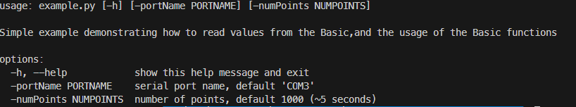

# python-basic (snifflogic_basic package)

Python SDK for communicating with the Sniff Controller Basic of Sniff Logic

## Usage

Install the module using `pip`

```bash
pip install git+https://github.com/snifflogic/python-basic
```

To run the example, run

```bash
python -m snifflogic_basic.example
```

To use in your own project,

```python
from snifflogic_basic import *
```

And then you can use `Basic` as shown in `example.py`

## Example script

The example is in `example.py`. It will connect to the given `portName` (default is `COM3`) and will show `numPoint` datapoints (default 1000).




## Files

- `basic.py` - a class representing the Basic device.
- `example.py` - a script demonstrating how to use the Basic class. You can use from command line as follows:

## Class APIs

### class Basic(builtins.object)

Basic(port: str) -> None

Class representing the Sniff Controller Basic

#### **init**(self, port: str) -> None

    Initialize the Basic at port `port`

    Args:
        port (str): The name of the port the Basic is connected at
        In Windows, will look like `COM4`
        In Mac, will look like `/dev/tty.usbserial-A6004byf`

    Raises:
        IOError: If could not connect to the Basic. Check that the port
        given is indeed the correct port and that the LED on the Basic is ON.

#### close(self)

    close communication with the Basic

#### get_data(self) -> float

    Get single pressure value from the Sniff Controller Basic

    Returns:
        float: pressure in Pascal

#### parse_data(self, raw_data: str)

    Parse the given raw data string and return pressure in Pascal

    Args:
        raw_data (String): the raw data received from the basic via serial port

    Returns:
        double: the pressure value in Pascal

## Dependencies

- [pyserial](https://pyserial.readthedocs.io/en/latest/) - for communicating with the Basic.

## Bugs

If you've encountered a bug, please [open an issue](https://github.com/snifflogic/python-basic/issues). Include details about your device, operating system and Python version. Don't forget to attach your code.

## Contribute

Have you implemented something useful that could benefit others? Don't hesitate to submit a pull request.
